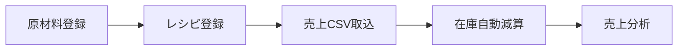

# AirREGI 在庫・売上管理システム

> カフェ・飲食店向けの原材料ベース在庫管理 × 売上分析システム

AirREGIの売上データを活用し、原材料在庫を自動で減算。天候データと連携した売上分析で、データドリブンな店舗運営をサポートします。

[](https://ipo-inventory-sales-management.vercel.app)
[](https://kit.svelte.dev/)
[](https://www.typescriptlang.org/)
[](https://firebase.google.com/)

---

## 📋 目次

- [主な機能](#主な機能)
- [技術スタック](#技術スタック)
- [セットアップ](#セットアップ)
- [使い方](#使い方)
- [データベース構造](#データベース構造)
- [デプロイ](#デプロイ)
- [ドキュメント](#ドキュメント)

---

## ✨ 主な機能

### 在庫管理

- 🧪 **原材料管理**: 原材料の在庫数をリアルタイムで管理
- 📝 **レシピ登録**: 商品ごとに使用する原材料と使用量を登録（オートコンプリート対応）
- 📊 **自動在庫減算**: AirREGIの売上CSVから自動的に原材料在庫を減算
- ⚠️ **在庫アラート**: 原材料が少なくなったら視覚的に警告表示
- 📋 **未登録商品管理**: レシピ未登録の商品を一覧表示・管理

### 売上分析

- 📈 **期間集計分析**: 日別・週別・月別の売上推移をグラフ表示
- 🏆 **商品別トレンド**: 商品ごとの販売数・売上額をランキング形式で可視化
- 🌤️ **天候データ連携**: 売上データに天候情報を紐付けて分析（晴れ・曇り・雨など）
- 📅 **カレンダービュー**: 日別売上をカレンダー形式で確認・処理状況を管理
- 💰 **統計ダッシュボード**: 在庫価値、低在庫原材料数、売上サマリーを一目で把握

### システム機能

- 🔥 **Firebase連携**: リアルタイムデータベースで複数端末から利用可能
- 🔒 **セキュリティ**: CSRF保護、レート制限、Firestore完全ロックダウン
- 🎨 **ダークモード対応**: 目に優しいダークモード（自動保存）
- 📱 **レスポンシブ**: モバイル・タブレット・デスクトップ対応
- 🌐 **文字コード対応**: Shift-JIS/UTF-8のCSVファイルに対応

---

## 🛠️ 技術スタック

| カテゴリ | 技術 |
|---------|------|
| **フロントエンド** | SvelteKit 2 + Svelte 5 + TypeScript |
| **データベース** | Firebase Firestore + Firebase Admin SDK |
| **認証・セキュリティ** | CSRF保護、レート制限、セキュリティルール |
| **ビルドツール** | Vite 5 |
| **スタイリング** | Tailwind CSS |
| **アイコン** | Lucide Svelte |
| **外部API** | Open-Meteo API（天候データ） |
| **デプロイ** | Vercel |

### コード品質

- 📊 **総コード行数**: 8,874行
- 📁 **ファイル数**: 56ファイル
- 🎯 **TypeScript使用率**: 100%
- ✅ **完成度スコア**: 8.25/10

---

## 🚀 セットアップ

### 前提条件

- Node.js 20.x 以上
- npm または yarn
- Firebaseアカウント

### 1. リポジトリのクローンと依存関係のインストール

```bash
git clone <repository-url>
cd airregi-inventory
npm install
```

### 2. Firebase のセットアップ

詳細な手順は [📘 Firebase セットアップガイド](./docs/FIREBASE_SETUP.md) を参照してください。

```bash
# 環境変数ファイルをコピー
cp .env.example .env
```

`.env` ファイルに以下を設定:

```env
# Firebase クライアント設定（Firebaseコンソールから取得）
PUBLIC_FIREBASE_API_KEY=your_api_key
PUBLIC_FIREBASE_AUTH_DOMAIN=your_project_id.firebaseapp.com
PUBLIC_FIREBASE_PROJECT_ID=your_project_id
PUBLIC_FIREBASE_STORAGE_BUCKET=your_project_id.appspot.com
PUBLIC_FIREBASE_MESSAGING_SENDER_ID=your_sender_id
PUBLIC_FIREBASE_APP_ID=your_app_id

# Firebase Admin SDK（本番環境のみ）
FIREBASE_ADMIN_PROJECT_ID=your_project_id
FIREBASE_ADMIN_SERVICE_ACCOUNT_KEY=your_base64_encoded_key
```

### 3. 開発サーバーの起動

```bash
npm run dev
```

ブラウザで `http://localhost:5173` を開いてください。

> **💡 開発環境の注意**: 開発環境ではFirebase Admin SDKは不要です。クライアントSDKのみで動作します。

---

## 📖 使い方

### 基本的なワークフロー



### 1. 原材料の登録

1. **ホームページ** または **原材料管理ページ** に移動
2. 「原材料を追加」ボタンをクリック
3. 以下の情報を入力:
   - 原材料名（例: コーヒー豆、牛乳、砂糖）
   - 単位（例: kg、L、個）
   - 現在在庫数
   - 最小在庫レベル（この値を下回ると警告表示）
   - 仕入先（任意）
   - 単価（任意）
4. 「追加」をクリック

### 2. レシピの登録

1. 「レシピ管理」ページに移動
2. 「レシピを追加」ボタンをクリック
3. 商品名を入力（例: ブレンドコーヒー、カフェラテ）
4. 使用する原材料を追加:
   - 原材料名を入力（オートコンプリートで既存の原材料から選択可能）
   - 使用量と単位を入力（例: 15g、200ml）
   - 複数の原材料を追加可能
5. 「保存」をクリック

### 3. 売上データのインポート

1. **ホームページ** の「売上取込」ボタンをクリック
2. AirREGIから出力した売上CSVファイルを選択
   - Shift-JIS/UTF-8エンコーディング自動検出
   - 「男性」「女性」などのカテゴリ行は自動的に除外
3. 自動処理:
   - ✅ **登録済み商品**: 原材料の在庫が自動減算
   - 📋 **未登録商品**: 未登録商品リストに追加
   - 📊 **日別売上**: カレンダーに集計データを保存
   - 🌤️ **天候情報**: 自動的に取得して紐付け

### 4. 未登録商品の対応

1. 「未登録商品」ページで商品を確認
2. 「レシピ登録」ボタンをクリック
3. 商品名が自動入力された状態でレシピ登録画面が開く
4. 使用する原材料を登録
5. 登録後、未登録リストから自動的に削除

### 5. 売上分析の活用

#### カレンダービュー
- 📅 日別売上を一覧表示
- 🌤️ 天候アイコンで天気を確認
- ✅ 在庫処理済みかどうかをステータス表示
- 📊 日付クリックで詳細ページへ

#### 分析ページ
- 📈 **期間集計**: 日別・週別・月別の売上推移グラフ
- 🏆 **商品別ランキング**: 販売数・売上額でソート可能
- 🌦️ **天候別分析**: 天候ごとの売上傾向を把握
- 📊 **統計サマリー**: 総売上、平均単価、商品数などを表示

---

## 🗄️ データベース構造

Firestore コレクション構成:

### `ingredients` (原材料)

```typescript
{
  id: string;              // ドキュメントID
  name: string;            // 原材料名
  unit: string;            // 単位（kg, L, 個など）
  currentStock: number;    // 現在在庫数
  minStockLevel: number;   // 最小在庫レベル
  supplier?: string;       // 仕入先
  unitPrice?: number;      // 単価
  description?: string;    // 説明
  createdAt: string;       // 作成日時
  updatedAt: string;       // 更新日時
}
```

### `recipes` (レシピ)

```typescript
{
  id: string;              // ドキュメントID
  productName: string;     // 商品名
  ingredients: [
    {
      name: string;        // 原材料名
      quantity: number;    // 使用量
      unit: string;        // 単位
    }
  ];
  createdAt: string;
  updatedAt: string;
}
```

### `dailySales` (日別売上)

```typescript
{
  id: string;              // 日付（YYYY-MM-DD）
  date: string;            // 日付
  totalSales: number;      // 総売上額
  totalProfit: number;     // 総粗利
  totalQuantity: number;   // 総販売数
  productCount: number;    // 商品種類数
  weather?: string;        // 天候（sunny, cloudy, rainyなど）
  inventoryProcessed: boolean;  // 在庫処理済みフラグ
  processedAt?: string;    // 処理日時
  salesData: [             // 商品別売上データ
    {
      productName: string;
      soldQuantity: number;
      totalSales: number;
      grossProfit: number;
    }
  ];
}
```

### `unregisteredProducts` (未登録商品)

```typescript
{
  productName: string;     // 商品名（ドキュメントID）
  totalQuantity: number;   // 累計販売数
  firstSeenAt: string;     // 初回検出日時
  lastSeenAt: string;      // 最終検出日時
  dates: [
    {
      date: string;
      quantity: number;
    }
  ];
}
```

---

## 🚢 デプロイ

### Vercel へのデプロイ

詳細な手順は [📘 デプロイガイド](./docs/DEPLOYMENT.md) を参照してください。

1. **Vercelプロジェクトを作成**

```bash
npm install -g vercel
vercel login
vercel
```

2. **環境変数を設定**

Vercel ダッシュボードで以下の環境変数を設定:

| 変数名 | 説明 | 必須 |
|-------|------|------|
| `PUBLIC_FIREBASE_API_KEY` | Firebase API キー | ✅ |
| `PUBLIC_FIREBASE_PROJECT_ID` | Firebase プロジェクトID | ✅ |
| `FIREBASE_ADMIN_SERVICE_ACCOUNT_KEY` | サービスアカウントキー（Base64） | ✅ |

3. **デプロイ実行**

```bash
vercel --prod
```

4. **Firestore セキュリティルールを設定**

```javascript
rules_version = '2';
service cloud.firestore {
  match /databases/{database}/documents {
    match /{document=**} {
      allow read, write: if false;  // 完全ロックダウン
    }
  }
}
```

> **⚠️ 重要**: 本番環境では必ずFirebase Admin SDKのサービスアカウントキーを設定してください。詳細は [Vercelデプロイエラー解決ガイド](./docs/VERCEL_DEPLOYMENT_FIX.md) を参照。

---

## 📚 ドキュメント

プロジェクトの詳細なドキュメントは `docs/` フォルダにあります:

| ドキュメント | 説明 |
|------------|------|
| [📘 Firebase セットアップ](./docs/FIREBASE_SETUP.md) | Firebaseプロジェクトの作成と設定 |
| [📘 環境変数ガイド](./docs/ENV_FIX_GUIDE.md) | 環境変数のトラブルシューティング |
| [📘 デプロイガイド](./docs/DEPLOYMENT.md) | 本番環境へのデプロイ手順 |
| [📘 Vercelエラー解決](./docs/VERCEL_DEPLOYMENT_FIX.md) | Vercelデプロイ時のエラー対処法 |
| [📘 セキュリティ](./docs/SECURITY.md) | セキュリティアーキテクチャと実装 |
| [📘 トラブルシューティング](./docs/TROUBLESHOOTING.md) | よくある問題と解決方法 |

---

## 🔧 開発コマンド

```bash
# 開発サーバー起動
npm run dev

# ビルド
npm run build

# プレビュー（ビルド後）
npm run preview

# 型チェック
npm run check

# 型チェック（ウォッチモード）
npm run check:watch

# リント
npm run lint

# フォーマット
npm run format
```

---

## 🐛 トラブルシューティング

よくある問題と解決方法:

### 開発環境で500エラーが出る
- 開発環境ではFirebase Admin SDKは不要です
- `.env` にクライアントSDKの設定があれば動作します

### Vercelデプロイ後に500エラーが出る
- `FIREBASE_ADMIN_SERVICE_ACCOUNT_KEY` が設定されているか確認
- [Vercelエラー解決ガイド](./docs/VERCEL_DEPLOYMENT_FIX.md) を参照

### CSVインポートができない
- ファイルがShift-JISまたはUTF-8エンコーディングか確認
- AirREGI標準フォーマットのCSVか確認

詳細は [トラブルシューティングガイド](./docs/TROUBLESHOOTING.md) を参照してください。

---

## 🎯 実装済み機能（v1.0）

- ✅ 原材料・レシピ管理
- ✅ 売上CSV自動取込（高速化対応）
- ✅ 在庫自動減算
- ✅ 天候データ連携
- ✅ 売上分析（期間・天候・商品別）
- ✅ 在庫予測機能
- ✅ カレンダービュー
- ✅ Notion API連携（原材料・レシピ同期）
- ✅ ダークモード
- ✅ レスポンシブデザイン

## 🎯 今後の展開

- [ ] Firebase Authentication統合（マルチユーザー対応）
- [ ] リアルタイム在庫アラート通知
- [ ] 発注管理機能（自動発注リスト生成）
- [ ] モバイルアプリ対応（Capacitor/Ionic）
- [ ] マルチテナント対応（複数店舗管理）
- [ ] GraphQL導入
- [ ] オフライン対応（PWA）

---

## 📄 ライセンス

MIT License

Copyright (c) 2026 AirREGI 在庫・売上管理システム

---

## 👤 開発情報

- **開発期間**: 2週間
- **開発者**: 1名
- **総コード行数**: 8,874行
- **使用言語**: TypeScript (100%)

---

<div align="center">

**🎉 データドリブンな店舗運営を、もっとシンプルに。**

Made with ❤️ using SvelteKit & Firebase

</div>
